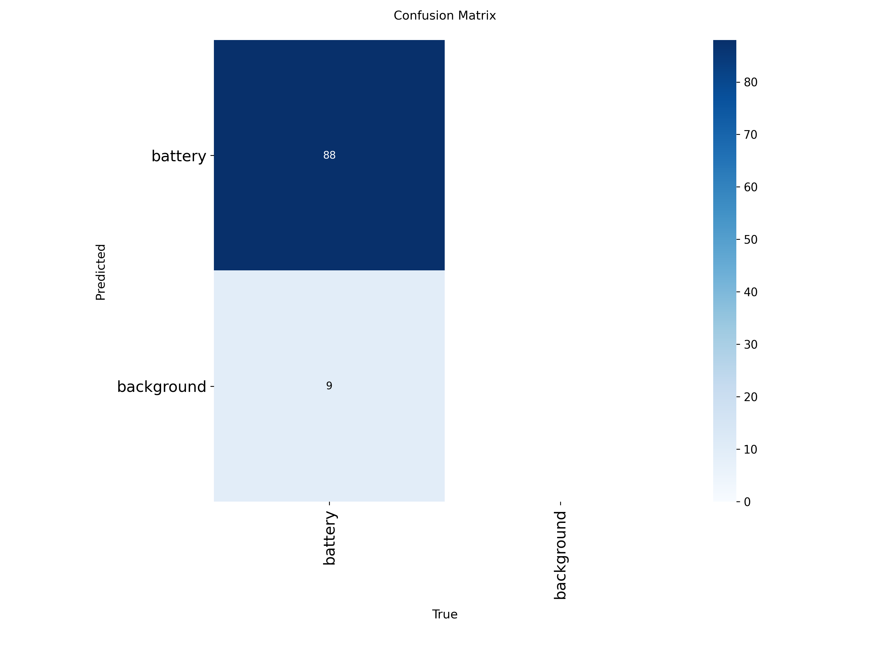
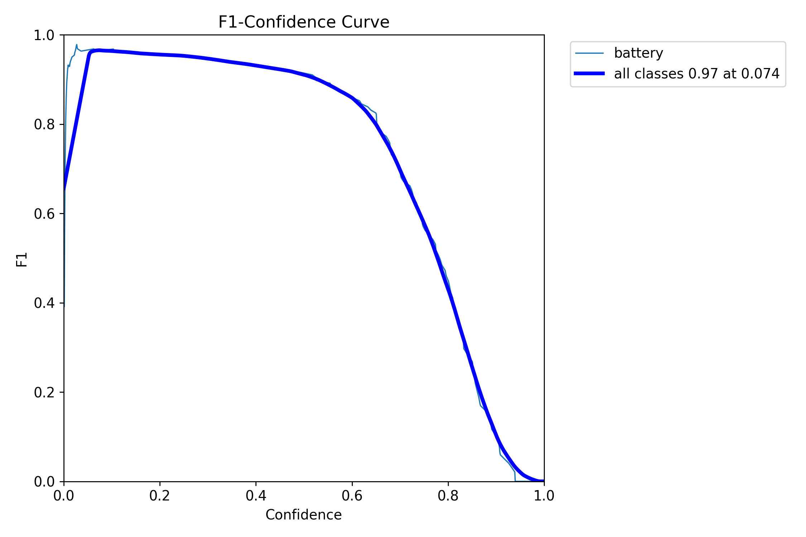
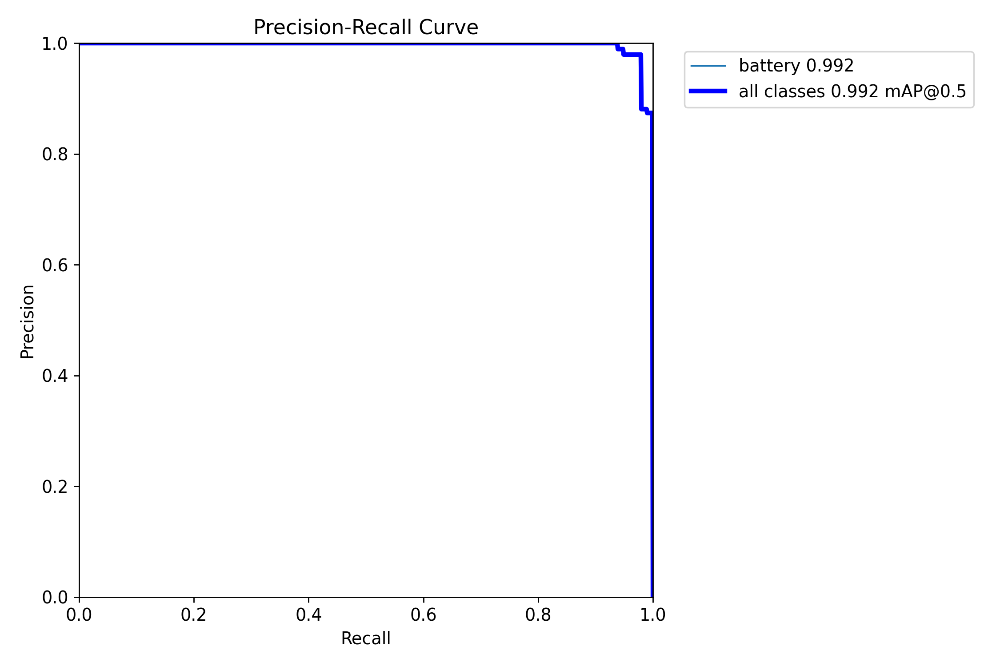
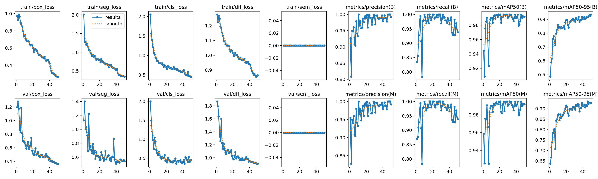

# 🔋 Capstone Redbacks Project 7 – Computer Vision

Computer Vision module for **Redbacks Project 7 – E-waste Battery Extraction**.

This repository contains:
- Dataset preparation workflows
- Synthetic data generation
- YOLO segmentation model training
- Multi-model evaluation
- Performance analysis for robotic battery extraction systems

The project focuses on detecting lithium batteries inside mobile phones to support safe robotic extraction during e-waste recycling.

---

# 📌 Project Overview

Lithium batteries inside mobile phones are hazardous during recycling because they may cause:

- Fire
- Explosion
- Toxic leakage

This project uses deep learning-based computer vision models to accurately detect and segment batteries inside mobile devices so robotic systems can safely locate and extract them.

---

# 🎯 Objectives

- Detect lithium batteries using computer vision
- Train YOLO segmentation models on real + synthetic datasets
- Compare multiple detection architectures
- Evaluate speed vs accuracy trade-offs
- Build a scalable robotic vision pipeline
- Support future integration with ROS / Isaac Sim / MATLAB

---

# 🧠 Models Implemented

| Model | Type | Purpose |
|---|---|---|
| YOLOv8n-seg | Segmentation | Best deployment balance |
| YOLOv11x-seg | Segmentation | Highest accuracy |
| YOLO26n-seg | Segmentation | Experimental comparison |
| RetinaNet | Bounding Box | Baseline detector |
| SSD | Bounding Box | Lightweight baseline |

---

# 📂 Repository Structure

```text
Capstone-Redback-Project_7-Computer_Vision/
│
├── assets/
│   ├── YOLOv8n-seg/
│   ├── YOLOv11x-seg/
│   ├── YOLO26n-seg/
│   ├── SSD/
│   ├── RetinaNet/
│   ├── confusion_matrix.png
│   ├── f1_curve.png
│   ├── pr_curve.png
│   └── results.png
│
├── dataset/                  <- Downloaded automatically from Kaggle
│   ├── images/
│   ├── labels/
│   ├── annotations_coco/
│   └── data.yaml
│
├── docs/
│   ├── Model Research Report.pdf
│   └── makingNewAutomationBlenderFile.md
│
├── scripts/
│   ├── blenderGenerationScript.py
│   ├── imgscraper.py
│   └── YoutubeScraper.md
│
├── requirements.txt
├── README.md
├── .gitignore
├── download_dataset.sh
└── download_dataset.bat
```

---

# 📊 Dataset

The dataset is hosted externally on Kaggle because it is too large for GitHub.

## 🔗 Kaggle Dataset

https://www.kaggle.com/datasets/mokshbansal07/project-7

> ⚠️ Note:
> The dataset is currently private.
>
> To use it:
> - Make the dataset public
> OR
> - Add collaborators on Kaggle

---

# 📦 Dataset Structure

After downloading, the dataset should look like:

```text
dataset/
│
├── images/
│   ├── train/
│   ├── val/
│   └── test/
│
├── labels/
│   ├── train/
│   ├── val/
│   └── test/
│
├── annotations_coco/
│   ├── train.json
│   ├── val.json
│   └── test.json
│
└── data.yaml
```

The dataset follows the YOLO segmentation format.

---

# ⚙️ Installation

## 1️⃣ Clone Repository

```bash
git clone https://github.com/YOUR_USERNAME/Capstone-Redback-Project_7-Computer_Vision.git

cd Capstone-Redback-Project_7-Computer_Vision
```

---

## 2️⃣ Install Requirements

```bash
pip install -r requirements.txt
```

---

# 📥 Download Dataset from Kaggle

## Step 1 — Install Kaggle API

```bash
pip install kaggle
```

---

## Step 2 — Download Kaggle API Token

Go to:

```text
Kaggle → Account → Create New API Token
```

This downloads:

```text
kaggle.json
```

Place it in:

### Windows

```text
C:\Users\YOUR_USERNAME\.kaggle\kaggle.json
```

### Linux / Mac

```text
~/.kaggle/kaggle.json
```

---

## Step 3 — Download Dataset

### Windows

```cmd
download_dataset.bat
```

### Linux / Mac

```bash
bash download_dataset.sh
```

OR manually:

```bash
mkdir dataset

kaggle datasets download -d mokshbansal07/project-7 -p dataset --unzip
```

---

# 🧾 data.yaml

Your `dataset/data.yaml` should contain:

```yaml
path: dataset

train: images/train
test: images/test
val: images/val

names:
  0: battery
```

---

# 🚀 Training

## Train YOLOv8n-seg

```bash
yolo task=segment mode=train model=yolov8n-seg.pt data=dataset/data.yaml epochs=50 imgsz=640 batch=4 device=0
```

---

## Train YOLOv11x-seg

```bash
yolo task=segment mode=train model=yolo11x-seg.pt data=dataset/data.yaml epochs=50 imgsz=640 batch=4 device=0
```

---

## Train YOLO26n-seg

```bash
yolo task=segment mode=train model=yolov26n-seg.pt data=dataset/data.yaml epochs=50 imgsz=640 batch=4 device=0
```

---

# 🧪 Validation

```bash
yolo task=segment mode=val model=runs/segment/train/weights/best.pt data=dataset/data.yaml device=0
```

---

# 📈 Evaluation Metrics

Models were evaluated using:

- Precision
- Recall
- F1 Score
- Mask IoU
- Confusion Matrix
- Latency
- FPS
- Centroid Error

---

# 📊 Results & Analysis

## 🔹 Confusion Matrix



### Insights
- High True Positives across YOLO models
- Very low False Positives
- Minimal False Negatives

---

## 🔹 F1 Curve



### Observations
- Best F1 score at moderate confidence thresholds
- Precision increases with confidence
- Recall decreases at high confidence

Optimal threshold:

```text
0.35 – 0.50
```

---

## 🔹 Precision Recall Curve



---

## 🔹 Training Results



---

# 📊 Model Comparison

| Model | Accuracy | Speed | Notes |
|---|---|---|---|
| YOLOv8n-seg | High | Fast | Best deployment balance |
| YOLOv11x-seg | Very High | Slow | Highest accuracy |
| YOLO26n-seg | High | Medium | Experimental |
| RetinaNet | Medium | Slow | Less efficient |
| SSD | Low | Fast | Lightweight baseline |

---

# 🏆 Final Recommendation

## ✅ Best Model for Deployment

### YOLOv8n-seg

Reasons:
- Real-time performance
- High segmentation accuracy
- Efficient GPU usage
- Suitable for robotic integration

---

## 🧠 Best Model for Accuracy

### YOLOv11x-seg

Reasons:
- Highest precision and recall
- Strong segmentation performance
- Best benchmarking model

---

# 🤖 Future Work

- Integration with robotic arm
- Isaac Sim + ROS integration
- MATLAB communication pipeline
- Synthetic data expansion using Blender
- Multi-object component detection
- Real-world deployment testing

---

# 📌 Notes

- GPU recommended (CUDA supported)
- Training outputs are stored inside `runs/`
- Only important evaluation images are kept in `assets/`
- Dataset is downloaded dynamically from Kaggle

---

# 🧹 .gitignore Recommended

```gitignore
dataset/
runs/
*.pt
*.zip
*.cache
__pycache__/
```

---

# 👨‍💻 Author

## Moksh Bansal
Computer Vision Sub-Team Lead

Redbacks Project 7 – E-waste Battery Extraction

Deakin University
